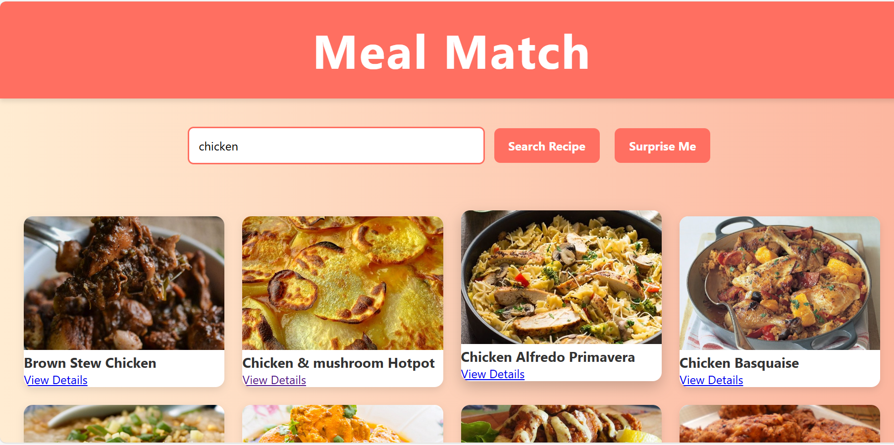

# Meal Match

## 📌 Description
Meal Match adalah web app pencarian resep makanan.  
User dapat mencari resep berdasarkan bahan yang dimiliki, atau menggunakan tombol **Surprise Me** untuk menemukan resep acak.

## Tech Stack
- HTML  
- CSS  
- JavaScript (Vanilla)  
- API: TheMealDB
  
## Features
1. Search by ingredient  
2. Surprise Me (random recipe)  
3. Responsive recipe cards (gambar, nama, link detail)  

---

##  Setup Instructions
1. Clone repository:
   ```bash
   git clone https://github.com/Hasnirah/meal-match.git
2. masuk ke folder project
   ```bash
   cd meal-match
3. buka index.html di browser

## Preview



## AI Support
Kode ini dikembangkan dengan bantuan IBM Granite model di Google Colab
untuk mempercepat pembuatan struktur awal HTML, CSS, dan JavaScript.

